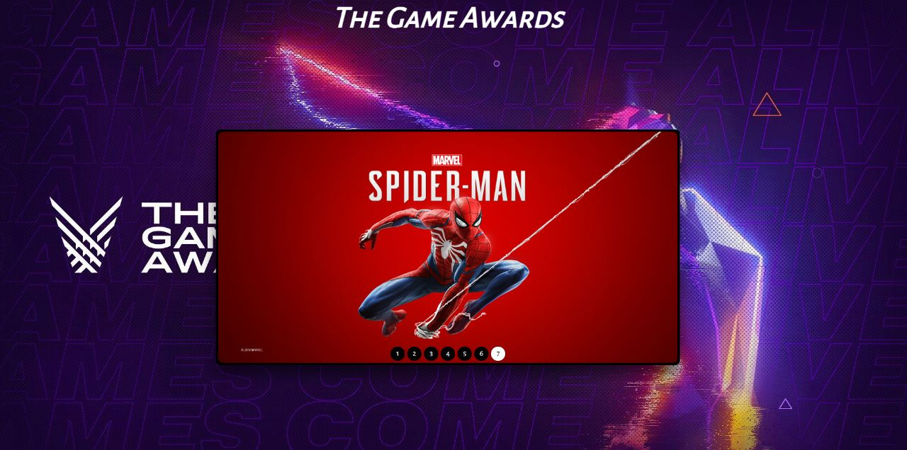
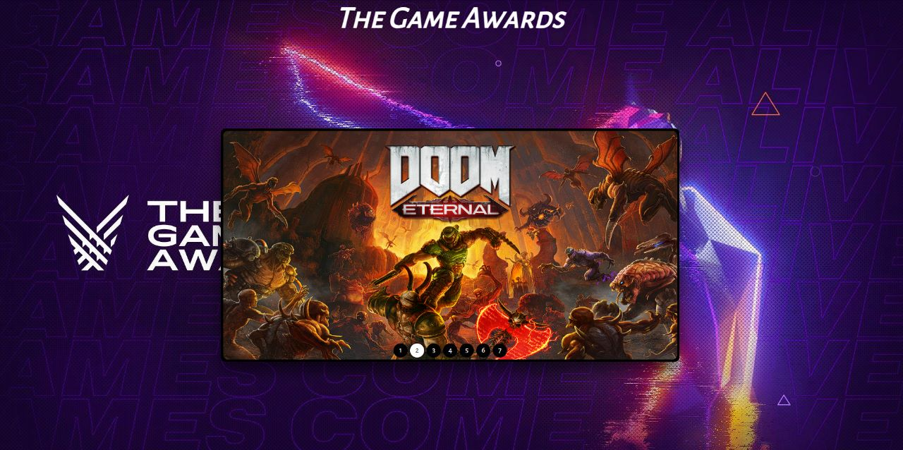
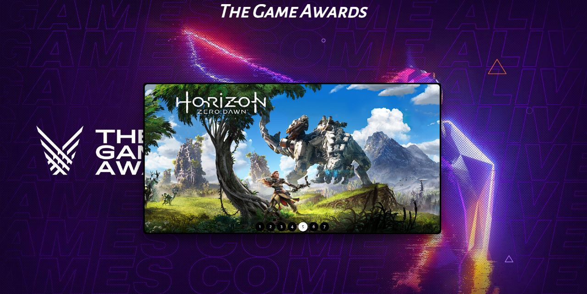

# SlideShow Games Awards

> Explorer

Projeto construído para reforçar conhecimentos adquiridos em desenvolvimento Front-End!

[ 🔗 Clique aqui para acessar](https://projeto-womens-cup.vercel.app/)

## 🚀 Tecnologias

- HTML
- CSS
- Javascript
- Git e Github

## 💻 Projeto

Mini-projeto SlideShow Games Awards contém ações para retroceder e avançar. Foram utilizados alguns recursos do javascript, como por exemplo, funções do tipo arrow, template string e manipulação de elementos HTML no DOM, sempre lembrando de criar um código limpo e semântico.

# 🧡 Contato

Email: jonhy.willy.jw71@gmail.com  
Linkedin: https://www.linkedin.com/in/jonhy-willy-57b1051a4/

Feito com ♥ by Jonhy
